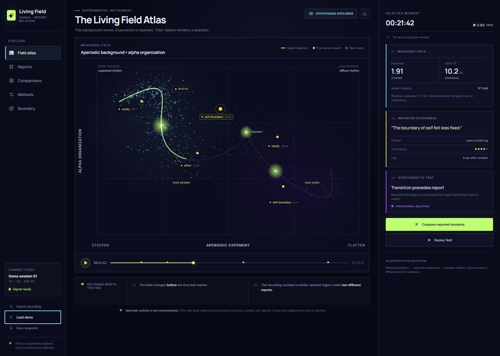

# Living Field

Living Field is a visual EEG/EOG research instrument for exploring how aperiodic (1/f-like) activity and oscillatory peaks vary across experimental conditions.

This repository contains the environment-study build used to compare six recordings from one participant: eyes-open baseline, eyes-closed baseline, video, still image, nature, and Sturm Hall. Posterior EEG was recorded at O1/O2, with EOG channels placed around the eyes.

Living Field is a standalone project with its own identity and scientific boundary. It is not a Flux EEG version or workflow mode.



## What the app makes visible

- A plain-language opening summary of the study's main result
- Condition-by-condition posterior EEG aperiodic exponent estimates
- Alpha peak organization and model-fit quality
- A direct EEG-versus-EOG comparison across conditions
- An interactive brain-and-eyes recording map for O1, O2, and the provisional EOG montage
- Moving-window response playback through each recording
- A video-drift view built from three provisional video-length segments
- An artifact-sensitivity view comparing raw and EOG-regressed estimates
- Methods, provenance, confidence labels, and interpretation boundaries

The interface preserves distinctions among measured signal, recording context, and hypotheses to test. It does not claim that 1/f activity is consciousness, that EEG and EOG measure the same process, or that this single-participant pilot establishes causation.

## Study status

The current build presents real pilot-study analysis outputs, but it should be read as exploratory:

- Sample size: one participant
- Sampling rate: 250 Hz
- Posterior EEG channels: O1 and O2
- EOG channel labels are provisional pending final montage confirmation
- Several condition estimates are aggregate-only or have limited accepted windows
- The long video lacked stimulus markers, so its three segments are temporal proxies rather than verified repeats

These limitations are shown in the interface rather than hidden.

## Run locally

Requirements: Node.js 20 or newer.

```bash
npm install
npm run dev
```

To create a production build and run the automated checks:

```bash
npm run build
npm test
```

## Windows desktop app

Living Field can also run as a secure, local-first Windows desktop application.

```bash
npm run desktop
```

To build the installable Windows setup program:

```bash
npm run desktop:build
```

The resulting installer is written to `installer-output/Living-Field-Setup.exe`. It creates optional desktop and Start menu shortcuts and allows the installation folder to be selected. See [DESKTOP.md](DESKTOP.md) for installation, privacy, and code-signing notes.

## Technology

- React
- Vite
- HTML Canvas for the quantitative visualizations
- Phosphor Icons
- Local Inter and Manrope font packages
- Electron for the installable Windows build

## Research boundary

Living Field is a hypothesis explorer, not a diagnostic system or consciousness detector. Its visualizations are intended to generate testable questions without collapsing neural activity, ocular activity, recording context, and philosophical interpretation into the same category.
